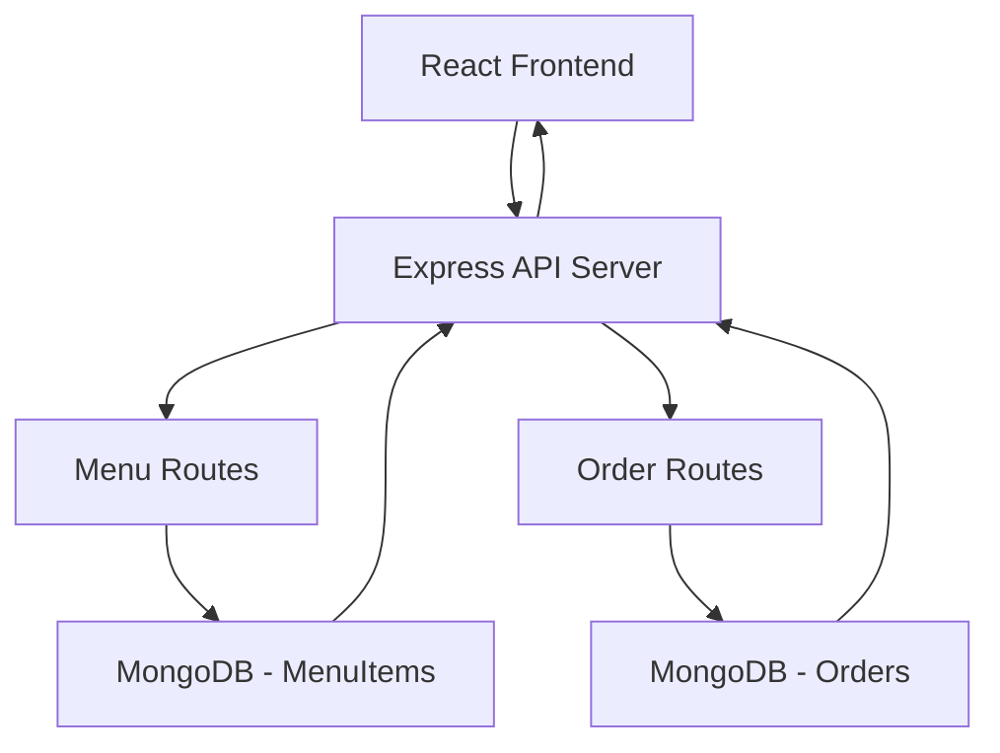

# POS Backend API - Product Requirements Document

## 1. Product Overview

A RESTful backend API for the POS (Point of Sale) system built with Node.js, Express.js, and MongoDB to handle menu management and order processing for coffee shops and retail businesses.

The API provides secure, scalable endpoints for managing menu items and processing orders, designed to seamlessly integrate with the existing React POS frontend application.

## 2. Core Features

### 2.1 Feature Module

Our POS backend API consists of the following main modules:

1. **Menu Management API**: CRUD operations for menu items with category support.
2. **Order Management API**: Order creation, retrieval, and management functionality.
3. **Database Layer**: MongoDB with Mongoose ODM for data persistence.
4. **Error Handling**: Comprehensive error handling with proper HTTP status codes.

### 2.2 API Endpoints

| Module           | Endpoint        | Method | Description                                           |
| ---------------- | --------------- | ------ | ----------------------------------------------------- |
| Menu Management  | /api/menu       | GET    | Fetch all menu items with optional category filtering |
| Menu Management  | /api/menu       | POST   | Create new menu item with validation                  |
| Menu Management  | /api/menu/:id   | PUT    | Update existing menu item by ID                       |
| Menu Management  | /api/menu/:id   | DELETE | Delete menu item by ID                                |
| Order Management | /api/orders     | POST   | Create new order with items and payment details       |
| Order Management | /api/orders     | GET    | Fetch all orders with pagination support              |
| Order Management | /api/orders/:id | GET    | Fetch single order by ID with full details            |

## 3. Core Process

**Menu Management Flow:**

1. Admin adds/updates menu items through React frontend
2. Frontend sends HTTP requests to menu API endpoints
3. API validates data and updates MongoDB database
4. Response sent back to frontend with success/error status

**Order Processing Flow:**

1. Customer selects items and proceeds to checkout in React frontend
2. Frontend sends order data to POST /api/orders endpoint
3. API validates order data and calculates totals
4. Order saved to MongoDB with timestamp and unique ID
5. Success response sent back with order confirmation

## 4. Data Requirements

### 4.1 Menu Item Data Structure

* **name**: String (required) - Item name

* **price**: Number (required) - Item price in currency

* **category**: String (required) - Category (coffee, snacks, drinks)

* **imageUrl**: String (optional) - URL to item image

* **createdAt**: Date (auto-generated) - Creation timestamp

* **updatedAt**: Date (auto-generated) - Last update timestamp

### 4.2 Order Data Structure

* **items**: Array (required) - Order items with itemId and quantity

* **total**: Number (required) - Total order amount

* **paymentMethod**: String (required) - Payment method (cash, debit, ewallet)

* **createdAt**: Date (auto-generated) - Order timestamp

* **status**: String (default: 'pending') - Order status

## 5. Technical Requirements

### 5.1 Technology Stack

* **Runtime**: Node.js (v18+)

* **Framework**: Express.js

* **Database**: MongoDB with Mongoose ODM

* **Middleware**: CORS, body-parser, error handling

* **Validation**: Express-validator or Joi

### 5.2 API Standards

* **Format**: RESTful API with JSON responses

* **Status Codes**: Proper HTTP status codes (200, 201, 400, 404, 500)

* **Error Handling**: Consistent error response format

* **CORS**: Enabled for React frontend integration

* **Validation**: Input validation for all endpoints

### 5.3 Security & Performance

* Input sanitization and validation

* Error logging and monitoring

* Database connection pooling

* Proper error messages without sensitive data exposure

