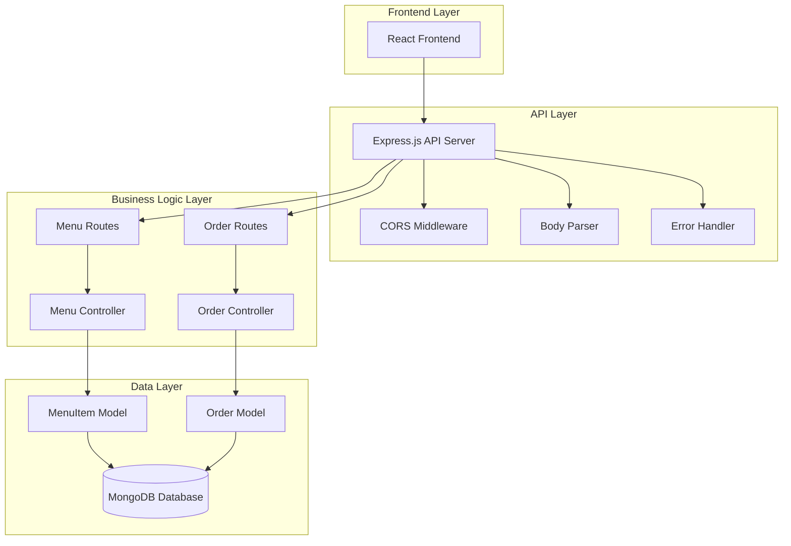
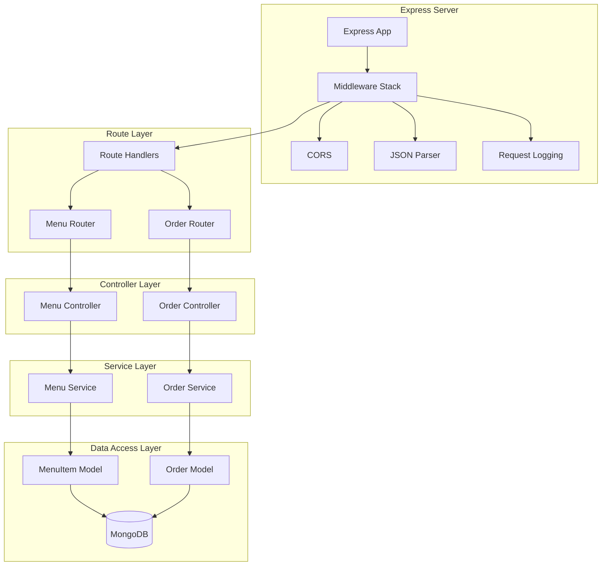
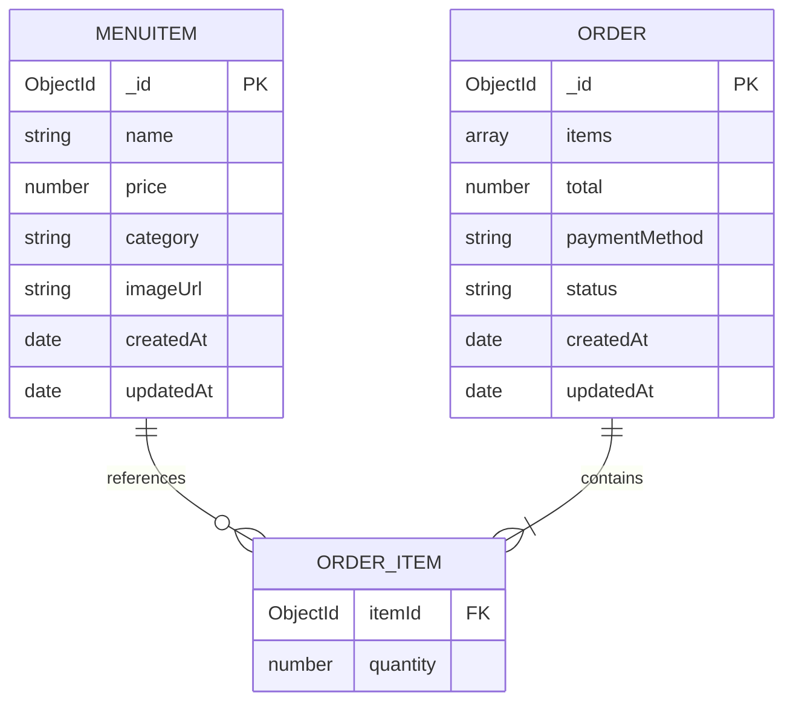

# POS Backend API - Technical Architecture Document

## 1. Architecture Design



## 2. Technology Description

* **Backend**: Node.js\@18 + Express.js\@4 + Mongoose\@7

* **Database**: MongoDB (local or MongoDB Atlas)

* **Middleware**: cors, express.json, express-validator

* **Development**: nodemon for auto-restart during development

## 3. Route Definitions

| Route                | Purpose                                                  |
| -------------------- | -------------------------------------------------------- |
| GET /api/menu        | Retrieve all menu items with optional category filtering |
| POST /api/menu       | Create new menu item with validation                     |
| PUT /api/menu/:id    | Update existing menu item by ID                          |
| DELETE /api/menu/:id | Remove menu item by ID                                   |
| POST /api/orders     | Create new order with items and payment info             |
| GET /api/orders      | Retrieve all orders with pagination                      |
| GET /api/orders/:id  | Retrieve specific order by ID                            |

## 4. API Definitions

### 4.1 Menu Management API

**Get All Menu Items**

```
GET /api/menu
```

Query Parameters:

| Param Name | Param Type | isRequired | Description                                 |
| ---------- | ---------- | ---------- | ------------------------------------------- |
| category   | string     | false      | Filter by category (coffee, snacks, drinks) |
| limit      | number     | false      | Limit number of results (default: 50)       |
| page       | number     | false      | Page number for pagination (default: 1)     |

Response:

| Param Name | Param Type | Description            |
| ---------- | ---------- | ---------------------- |
| success    | boolean    | Request success status |
| data       | array      | Array of menu items    |
| count      | number     | Total number of items  |

Example Response:

```json
{
  "success": true,
  "data": [
    {
      "_id": "64f8a1b2c3d4e5f6a7b8c9d0",
      "name": "Cappuccino",
      "price": 4.50,
      "category": "coffee",
      "imageUrl": "https://example.com/cappuccino.jpg",
      "createdAt": "2023-09-06T10:30:00.000Z",
      "updatedAt": "2023-09-06T10:30:00.000Z"
    }
  ],
  "count": 1
}
```

**Create Menu Item**

```
POST /api/menu
```

Request Body:

| Param Name | Param Type | isRequired | Description                             |
| ---------- | ---------- | ---------- | --------------------------------------- |
| name       | string     | true       | Menu item name (min: 2, max: 100 chars) |
| price      | number     | true       | Item price (min: 0.01)                  |
| category   | string     | true       | Category: coffee, snacks, drinks        |
| imageUrl   | string     | false      | URL to item image                       |

Example Request:

```json
{
  "name": "Espresso",
  "price": 3.50,
  "category": "coffee",
  "imageUrl": "https://example.com/espresso.jpg"
}
```

**Update Menu Item**

```
PUT /api/menu/:id
```

Request Body: Same as POST (all fields optional)

**Delete Menu Item**

```
DELETE /api/menu/:id
```

### 4.2 Order Management API

**Create Order**

```
POST /api/orders
```

Request Body:

| Param Name        | Param Type | isRequired | Description                          |
| ----------------- | ---------- | ---------- | ------------------------------------ |
| items             | array      | true       | Array of order items                 |
| items\[].itemId   | string     | true       | MongoDB ObjectId of menu item        |
| items\[].quantity | number     | true       | Quantity (min: 1)                    |
| total             | number     | true       | Total order amount                   |
| paymentMethod     | string     | true       | Payment method: cash, debit, ewallet |

Example Request:

```json
{
  "items": [
    {
      "itemId": "64f8a1b2c3d4e5f6a7b8c9d0",
      "quantity": 2
    }
  ],
  "total": 9.00,
  "paymentMethod": "cash"
}
```

**Get All Orders**

```
GET /api/orders
```

Query Parameters:

| Param Name | Param Type | isRequired | Description                 |
| ---------- | ---------- | ---------- | --------------------------- |
| limit      | number     | false      | Limit results (default: 20) |
| page       | number     | false      | Page number (default: 1)    |
| status     | string     | false      | Filter by status            |

**Get Single Order**

```
GET /api/orders/:id
```

## 5. Server Architecture



## 6. Data Model

### 6.1 Data Model Definition



### 6.2 Mongoose Schemas

**MenuItem Schema**

```javascript
const menuItemSchema = new mongoose.Schema({
  name: {
    type: String,
    required: [true, 'Name is required'],
    trim: true,
    minlength: [2, 'Name must be at least 2 characters'],
    maxlength: [100, 'Name cannot exceed 100 characters']
  },
  price: {
    type: Number,
    required: [true, 'Price is required'],
    min: [0.01, 'Price must be greater than 0']
  },
  category: {
    type: String,
    required: [true, 'Category is required'],
    enum: ['coffee', 'snacks', 'drinks'],
    lowercase: true
  },
  imageUrl: {
    type: String,
    validate: {
      validator: function(v) {
        return !v || /^https?:\/\/.+/.test(v);
      },
      message: 'Invalid URL format'
    }
  }
}, {
  timestamps: true
});
```

**Order Schema**

```javascript
const orderSchema = new mongoose.Schema({
  items: [{
    itemId: {
      type: mongoose.Schema.Types.ObjectId,
      ref: 'MenuItem',
      required: true
    },
    quantity: {
      type: Number,
      required: true,
      min: [1, 'Quantity must be at least 1']
    }
  }],
  total: {
    type: Number,
    required: [true, 'Total is required'],
    min: [0, 'Total cannot be negative']
  },
  paymentMethod: {
    type: String,
    required: [true, 'Payment method is required'],
    enum: ['cash', 'debit', 'ewallet'],
    lowercase: true
  },
  status: {
    type: String,
    enum: ['pending', 'completed', 'cancelled'],
    default: 'pending'
  }
}, {
  timestamps: true
});
```

### 6.3 Database Indexes

```javascript
// MenuItem indexes
menuItemSchema.index({ category: 1 });
menuItemSchema.index({ name: 'text' });

// Order indexes
orderSchema.index({ createdAt: -1 });
orderSchema.index({ status: 1 });
orderSchema.index({ 'items.itemId': 1 });
```

## 7. Error Handling

### 7.1 Error Response Format

```javascript
{
  "success": false,
  "error": {
    "message": "Error description",
    "code": "ERROR_CODE",
    "details": {} // Additional error details if applicable
  }
}
```

### 7.2 HTTP Status Codes

* **200**: Success (GET, PUT)

* **201**: Created (POST)

* **400**: Bad Request (validation errors)

* **404**: Not Found (resource doesn't exist)

* **500**: Internal Server Error (server issues)

## 8. Environment Configuration

```javascript
// .env file structure
PORT=5000
MONGODB_URI=mongodb://localhost:27017/pos_system
NODE_ENV=development
CORS_ORIGIN=http://localhost:5173
```

