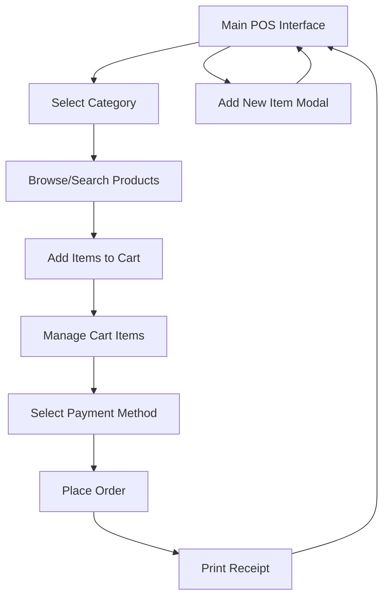

# POS Application - Product Requirements Document

## 1. Product Overview
A modern frontend-only Point of Sale (POS) application built with React.js and Tailwind CSS, designed for coffee shops and small retail businesses to manage orders and process transactions efficiently.

The application provides an intuitive interface for staff to browse products, manage cart items, and process orders with a clean white and mint green theme that ensures professional appearance and ease of use.

## 2. Core Features

### 2.1 Feature Module
Our POS application consists of the following main pages:
1. **Main POS Interface**: category sidebar, top navigation bar, product grid, cart sidebar with checkout functionality.

### 2.2 Page Details

| Page Name | Module Name | Feature description |
|-----------|-------------|---------------------|
| Main POS Interface | Category Sidebar | Display product categories (Coffee, Snacks, Drinks), highlight active category selection |
| Main POS Interface | Top Navigation Bar | Search products by name, add new menu items, print receipt, navigate back |
| Main POS Interface | Product Grid | Display menu items as cards with image, name, price, discount pricing, add to cart functionality |
| Main POS Interface | Cart Sidebar | Show selected items with quantity controls (+/-), item removal, subtotal/tax/total calculation, payment method selection (Cash, Debit Card, E-Wallet), place order processing |
| Main POS Interface | Add Item Modal | Create new menu items with name, price, image upload, category assignment |
| Main POS Interface | Print Receipt | Generate printable receipt with order details using browser print functionality |

## 3. Core Process

**Staff Operation Flow:**
1. Staff selects product category from left sidebar
2. Browses products in center grid or uses search functionality
3. Adds items to cart by clicking "Add to Cart" on product cards
4. Manages cart items (adjust quantities, remove items) in right sidebar
5. Reviews order total and selects payment method
6. Places order which clears cart and optionally prints receipt
7. Can add new menu items through "Add New Item" button when needed

## 4. User Interface Design

### 4.1 Design Style
- **Primary Colors**: White (#FFFFFF) and Mint Green (#10B981, #6EE7B7)
- **Button Style**: Rounded corners with hover effects, mint green primary buttons
- **Font**: Clean sans-serif fonts, 14-16px for body text, 18-24px for headings
- **Layout Style**: Card-based design with clean spacing, left sidebar navigation, grid layout for products
- **Icons**: Modern outline-style icons for buttons and navigation elements

### 4.2 Page Design Overview

| Page Name | Module Name | UI Elements |
|-----------|-------------|-------------|
| Main POS Interface | Category Sidebar | White background, mint green active state, vertical list layout with hover effects |
| Main POS Interface | Top Navigation Bar | White background, search input with mint green focus, orange accent buttons for actions |
| Main POS Interface | Product Grid | White product cards with subtle shadows, mint green "Add to Cart" buttons, responsive grid layout |
| Main POS Interface | Cart Sidebar | Light gray background, white item cards, mint green quantity controls, orange "Place Order" button |
| Main POS Interface | Add Item Modal | White modal with mint green form elements, file upload for images |

### 4.3 Responsiveness
Desktop-first design optimized for tablet screens (768px+) with touch-friendly interface elements. Responsive grid layout adjusts product cards based on screen size, maintaining usability across desktop and tablet devices.