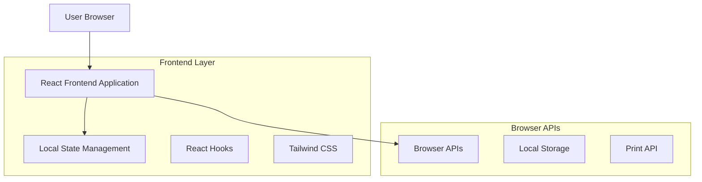
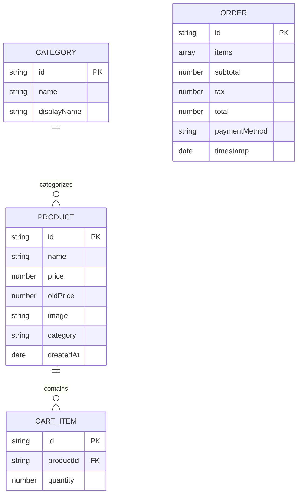

# POS Application - Technical Architecture Document

## 1. Architecture Design



## 2. Technology Description

* Frontend: React\@18 + Tailwind CSS\@3 + Vite

* State Management: React Hooks (useState, useEffect, useContext)

* Build Tool: Vite for fast development and optimized builds

* Storage: Browser Local Storage for data persistence

## 3. Route Definitions

| Route | Purpose                                                             |
| ----- | ------------------------------------------------------------------- |
| /     | Main POS interface with all functionality (single-page application) |

## 4. Component Architecture

### 4.1 Core Components

**Main App Component Structure:**

```
App
├── Header (Top Navigation)
│   ├── SearchBar
│   ├── ActionButtons (Add Item, Print, Back)
├── MainContent
│   ├── CategorySidebar
│   ├── ProductGrid
│   │   └── ProductCard
│   ├── CartSidebar
│   │   ├── CartItem
│   │   ├── OrderSummary
│   │   └── PaymentMethods
├── Modals
│   ├── AddItemModal
│   └── PrintReceiptModal
```

### 4.2 State Management Structure

**Global State (using Context API):**

```typescript
interface AppState {
  products: Product[];
  categories: Category[];
  cart: CartItem[];
  activeCategory: string;
  searchQuery: string;
  paymentMethod: 'cash' | 'debit' | 'ewallet';
}

interface Product {
  id: string;
  name: string;
  price: number;
  oldPrice?: number;
  image: string;
  category: string;
}

interface CartItem {
  id: string;
  product: Product;
  quantity: number;
}
```

## 5. Data Model

### 5.1 Data Model Definition



### 5.2 Local Storage Schema

**Products Storage:**

```javascript
// localStorage key: 'pos_products'
const defaultProducts = [
  {
    id: '1',
    name: 'Whipped Coffee',
    price: 45.00,
    oldPrice: null,
    image: '/images/whipped-coffee.jpg',
    category: 'coffee',
    createdAt: new Date().toISOString()
  },
  {
    id: '2',
    name: 'Cold Coffee',
    price: 45.00,
    oldPrice: 50.00,
    image: '/images/cold-coffee.jpg',
    category: 'coffee',
    createdAt: new Date().toISOString()
  }
  // ... more products
];
```

**Categories Storage:**

```javascript
// localStorage key: 'pos_categories'
const defaultCategories = [
  { id: 'all', name: 'all', displayName: 'All Items' },
  { id: 'coffee', name: 'coffee', displayName: 'Coffee' },
  { id: 'snacks', name: 'snacks', displayName: 'Snacks' },
  { id: 'drinks', name: 'drinks', displayName: 'Cold Drinks' }
];
```

**Cart Storage:**

```javascript
// localStorage key: 'pos_cart'
// Persisted cart items for session recovery
const cartItems = [
  {
    id: 'cart_1',
    productId: '1',
    quantity: 2
  }
];
```

## 6. Key Implementation Details

### 6.1 State Management Hooks

* `useProducts()`: Manage product CRUD operations

* `useCart()`: Handle cart operations (add, remove, update quantities)

* `useLocalStorage()`: Custom hook for persistent storage

* `usePrint()`: Handle print functionality

### 6.2 Responsive Design Breakpoints

* Desktop: 1024px and above

* Tablet: 768px to 1023px

* Mobile: Below 768px (basic support)

### 6.3 Performance Optimizations

* React.memo for product cards to prevent unnecessary re-renders

* useMemo for calculated values (cart totals, filtered products)

* useCallback for event handlers to prevent child re-renders

* Lazy loading for product images

### 6.4 Print Functionality

* CSS media queries for print styles

* Browser's native print API

* Formatted receipt layout with order details

* Hide non-essential UI elements during print

